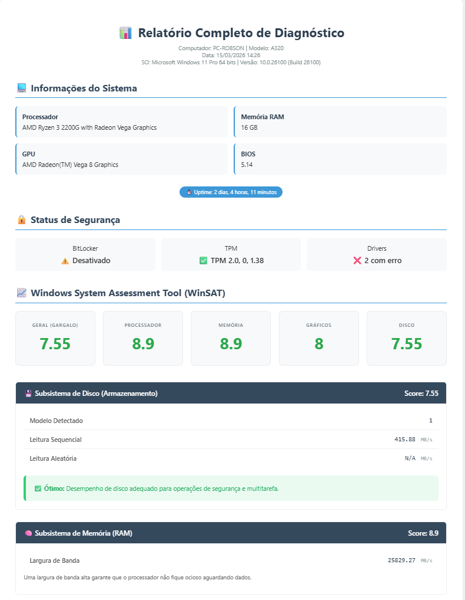
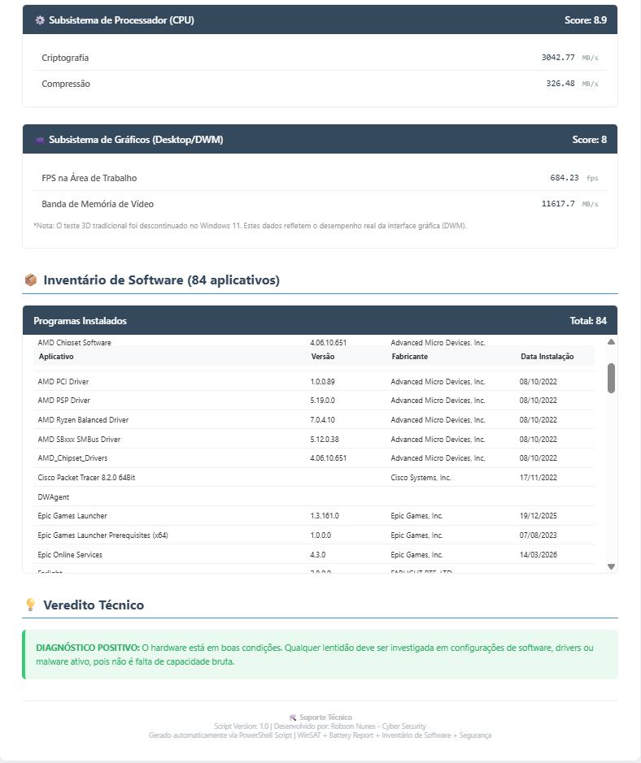

# 📊 WinSAT Performance Dashboard

Transforme dados brutos de benchmark do Windows em relatórios profissionais de HTML automaticamente.

Uma ferramenta PowerShell desenvolvida para analistas de Cyber Security, SysAdmins e suporte de TI que precisam identificar gargalos de hardware (Disco, RAM, CPU), auditar segurança (BitLocker, TPM) e inventariar software automaticamente.

## 🚀 Por que usar?

Muitas ferramentas de terceiros são pesadas, pagas ou exigem instalação. Este script utiliza o **WinSAT (Windows System Assessment Tool)** e cmdlets nativos do PowerShell para:

1.  Executar benchmarks oficiais de Disco, Memória, CPU e Gráficos.
2.  Extrair métricas críticas (Leitura Sequencial/Aleatória, Bandwidth, FPS do DWM).
3.  Gerar um **Dashboard HTML visual e interativo** pronto para apresentação a clientes ou gestão.
4.  Automatizar a defesa técnica: Prove com dados que o gargalo é o HD mecânico, não o antivírus.
5.  **Auditar Segurança:** Verifique status do BitLocker, TPM e drivers com erro.
6.  **Inventário de Software:** Liste todos os programas instalados com data de instalação.
7.  **Battery Report:** Gere relatórios detalhados de saúde da bateria (notebooks).

## 🛠️ Requisitos

-   Windows 10 ou Windows 11.
-   PowerShell 5.1 ou superior (já vem instalado).
-   **Execução como Administrador** (Necessário para rodar o `winsat formal` e coletar dados de segurança).
-   Notebook conectado à tomada (O WinSAT bloqueia execução em bateria).
-   Ambiente Físico (O teste não roda em VMs ou sessões RDP remotas).

## ⚡ Como Usar

1.  Baixe este repositório clicando em **Code > Download ZIP** ou clone:
    ```bash
    git clone https://github.com/robsoncyberdefense/WinSAT-Dashboard.git  
    ```

2.  Abra o **PowerShell como Administrador**.

3.  Navegue até a pasta onde baixou os arquivos:
    ```powershell
    cd caminho\para\WinSAT-Dashboard
    ```

4.  Execute o script diretamente da raiz:
    ```powershell
    .\GerarRelatorio_WinSAT.ps1
    ```
    *(Se der erro de execução, rode: `Set-ExecutionPolicy -Scope Process -ExecutionPolicy Bypass` antes)*

5.  Aguarde ~2 minutos. O relatório será gerado em `C:\Relatorios\Relatorio_Completo_Performance.html` e aberto automaticamente no navegador.

## 📸 Exemplo de Saída

O script gera um relatório HTML completo e profissional:

### Visão geral



## 🔍 O que é analisado?

O script extrai dados dos arquivos XML gerados pelo WinSAT (`Formal.Assessment`, `Disk`, `Mem`, `DWM`) e complementa com informações do sistema:

### 📊 Performance (WinSAT)

| Componente | Métricas Extraídas | Importância para Segurança/TI |
| :--- | :--- | :--- |
| **Disco** | Leitura Sequencial, Aleatória, Modelo | Identifica se o I/O saturado causa travamento em varreduras de EDR. |
| **Memória** | Largura de Banda (Bandwidth) | Detecta se a RAM é insuficiente para multitarefa moderna. |
| **CPU** | Criptografia, Compressão | Avalia capacidade de processamento de heurísticas em tempo real. |
| **Gráficos** | FPS do DWM, Banda de Vídeo | Analisa a fluidez da interface (útil para troubleshooting de UI). |

### 🔒 Segurança

| Recurso | Verificação | Importância |
| :--- | :--- | :--- |
| **BitLocker** | Status (Ativado/Desativado) | Conformidade com políticas de criptografia de disco. |
| **TPM** | Versão e presença | Requisito para Windows 11 e segurança de chaves. |
| **Drivers** | Dispositivos com erro | Identifica falhas de hardware ou drivers desatualizados. |

### 📦 Inventário

| Dado | Detalhamento |
| :--- | :--- |
| **Software** | Nome, Versão, Fabricante, Data de Instalação |
| **Limite** | Até 500 aplicativos (para performance do HTML) |
| **Hardware** | Processador, RAM, GPU, BIOS, Uptime |

### 🔋 Bateria (Notebooks)

-   Gera relatório detalhado em `C:\Relatorios\BatteryReport_[TIMESTAMP].html`
-   Inclui: Ciclos de carga, capacidade de design vs atual, histórico de uso.

## 📂 Arquivos Gerados

O script cria os seguintes arquivos em `C:\Relatorios\`:

1.  `Relatorio_Completo_Performance.html` - Dashboard principal com todas as métricas.
2.  `BatteryReport_[DATA_HORA].html` - Relatório detalhado da bateria (apenas notebooks).

## ⚠️ Limitações Conhecidas

-   **Virtualização:** O comando `winsat formal` não executa dentro de Máquinas Virtuais (VMware, VirtualBox, Hyper-V) ou ambientes Cloud PC (Windows 365), retornando Erro 13.
-   **Sessão Remota:** Não execute via RDP ou TeamViewer. O teste exige sessão local console (Erro 8/9).
-   **Energia:** Notebooks devem estar conectados à fonte de energia.
-   **Inventário Grande:** Em máquinas com mais de 500 softwares instalados, a lista será limitada para manter o HTML leve.

## 🔧 Personalização

Para alterar o limite de softwares ou o caminho de saída, edite o script:

```powershell
# Limite de softwares (linha ~105)
if ($softwareList.Count -gt 500) { # Altere 500 para outro valor }

# Caminho de saída (linha ~25)
$folderPath = "C:\Relatorios" # Altere para outro diretório
```
## 🤝 Contribuição
Sinta-se à vontade para abrir **Issues** ou **Pull Requests** se quiser adicionar novas métricas ou melhorar o layout do HTML.

## 📄 Licença
Este projeto está sob a licença **MIT**.  
Sinta-se livre para usar em ambientes corporativos.

**Autor:** Robson Nunes – Cyber Security  
**Versão:** 1.0  

LinkedIn: https://www.linkedin.com/in/robsonsecurity  
GitHub: https://github.com/robsoncyberdefense

## 📝 Changelog
### v1.0

- ✅ Relatório HTML completo e responsivo
- ✅ Benchmarks WinSAT (Disco, CPU, Memória, Gráficos)
- ✅ Inventário de software (32/64-bit) com conversão de datas
- ✅ Status de segurança (BitLocker, TPM, Drivers)
- ✅ Battery Report para notebooks
- ✅ HTML Encode para prevenção de XSS
- ✅ Limitação de 500 softwares para performance
- ✅ Criação automática do diretório de saída
- ✅ Verificação de privilégios administrativos
- ✅ Tratamento de erros robusto e fallbacks

